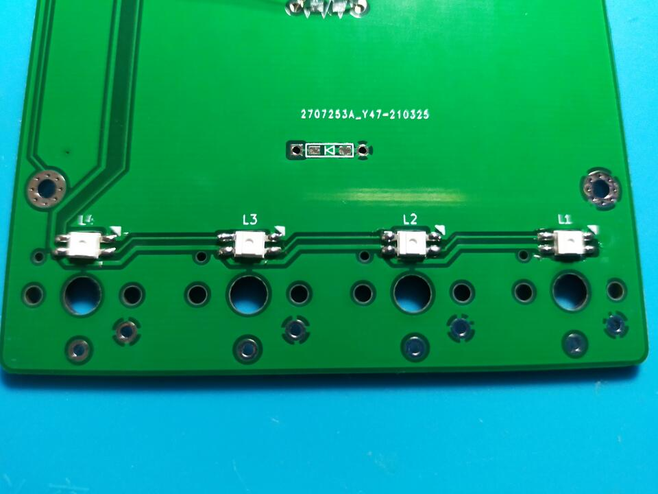
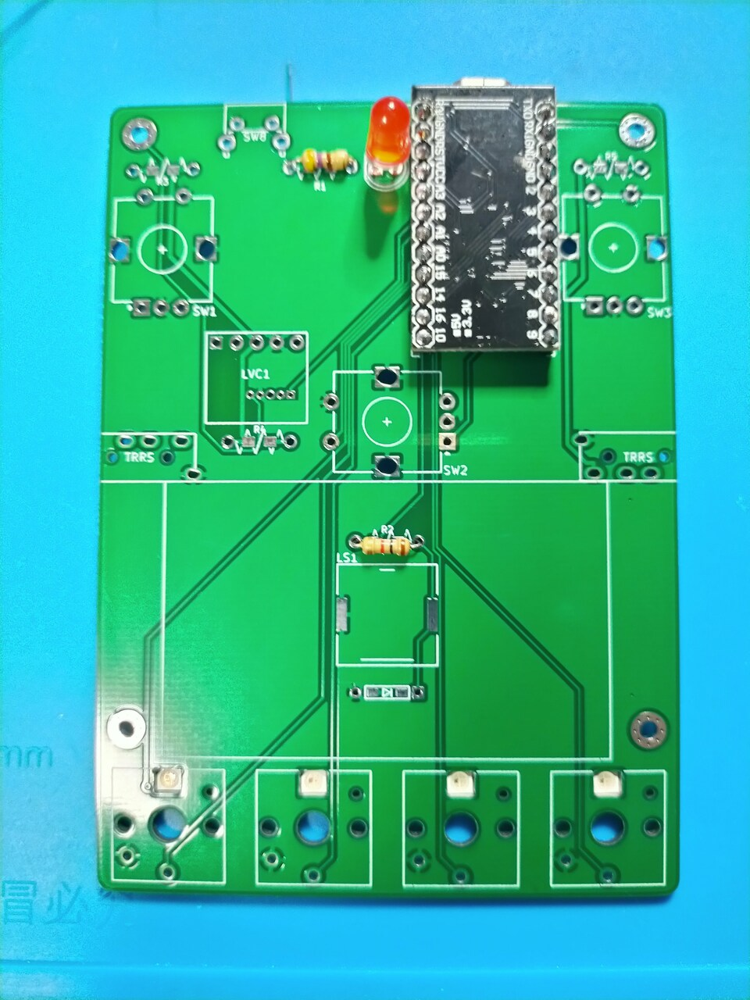
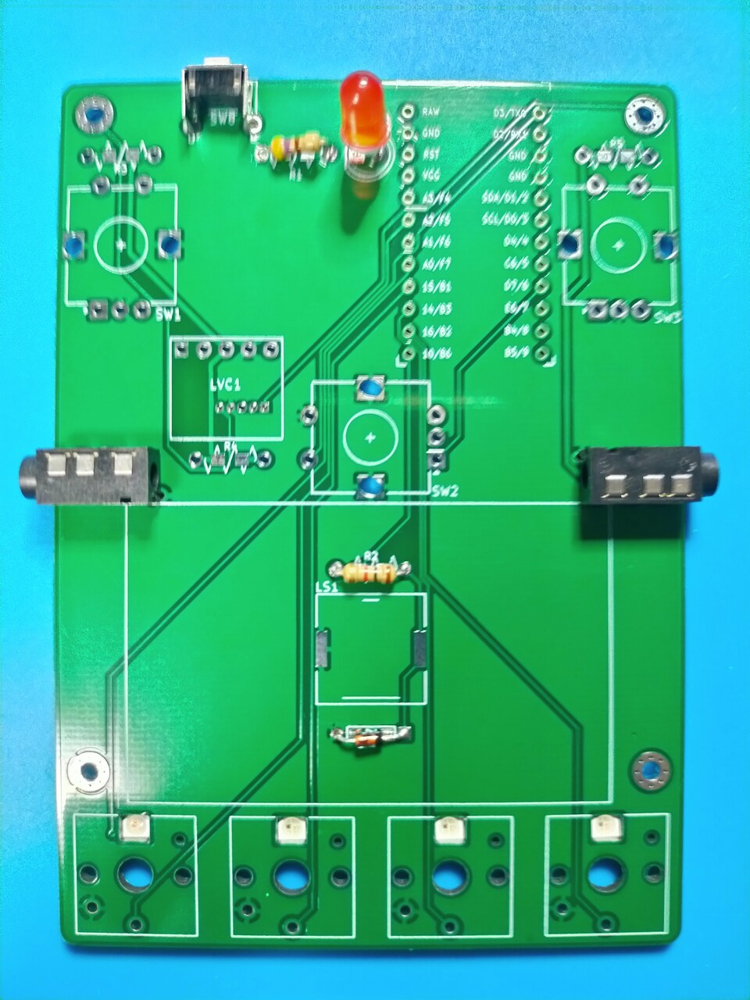
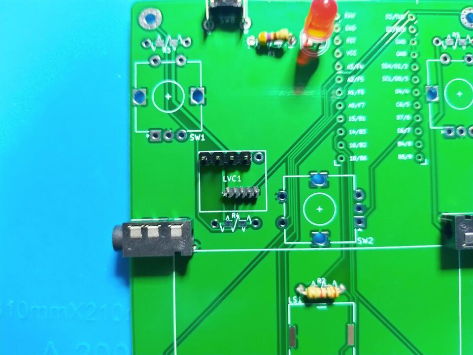
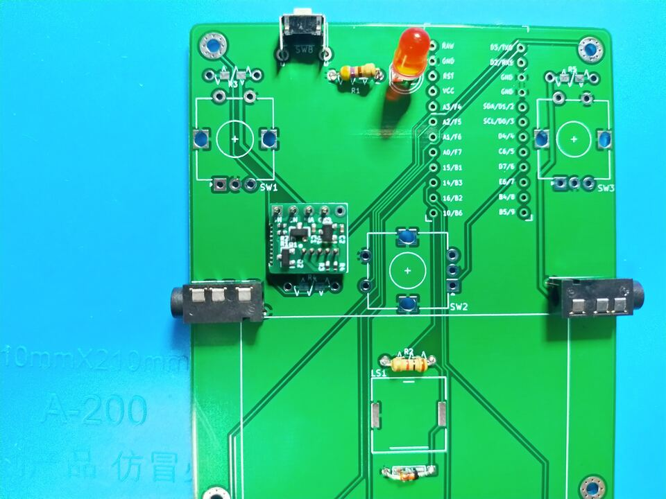
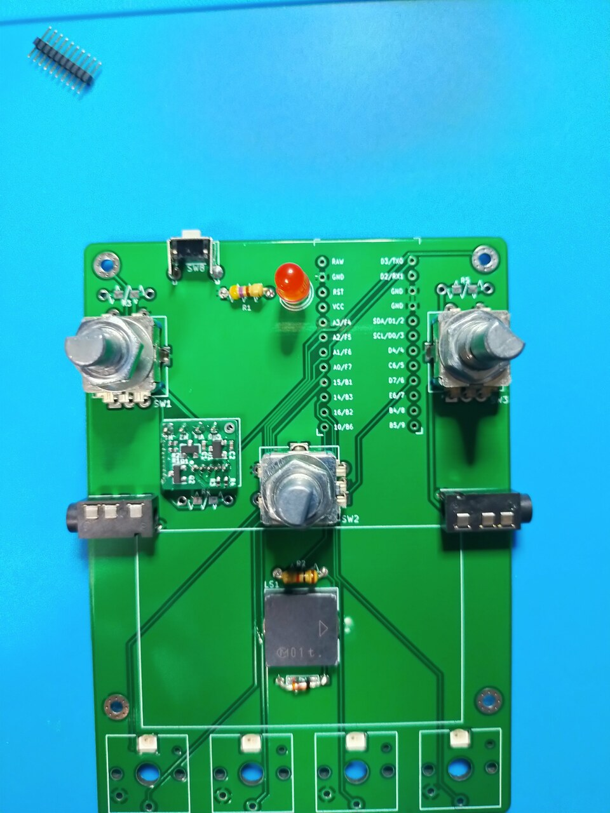
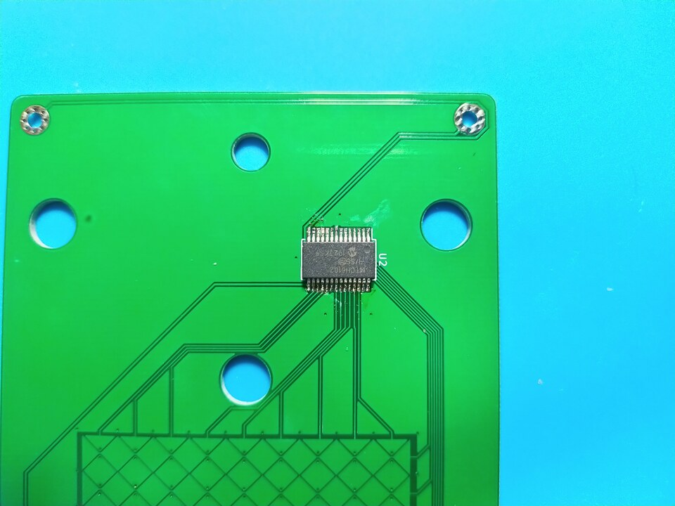
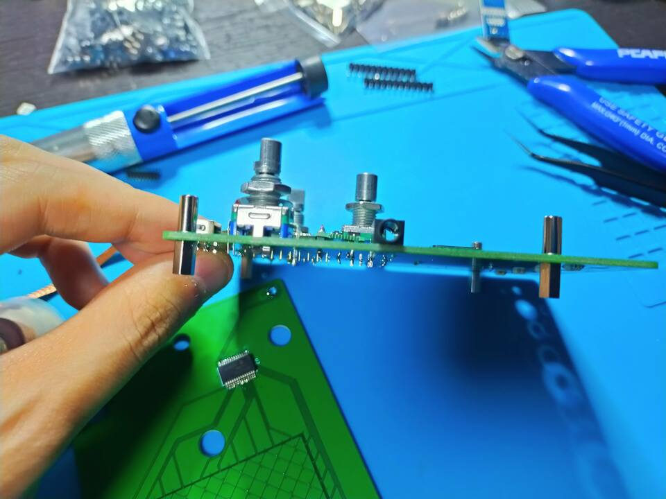
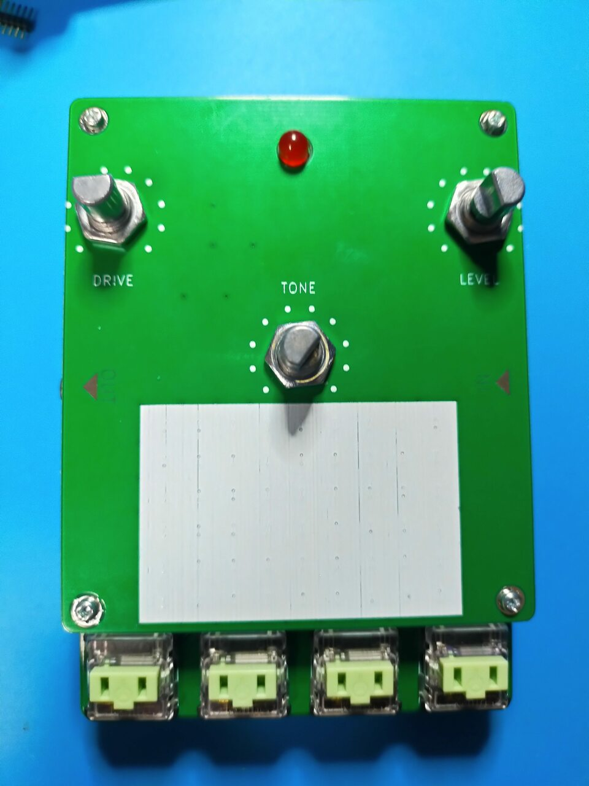
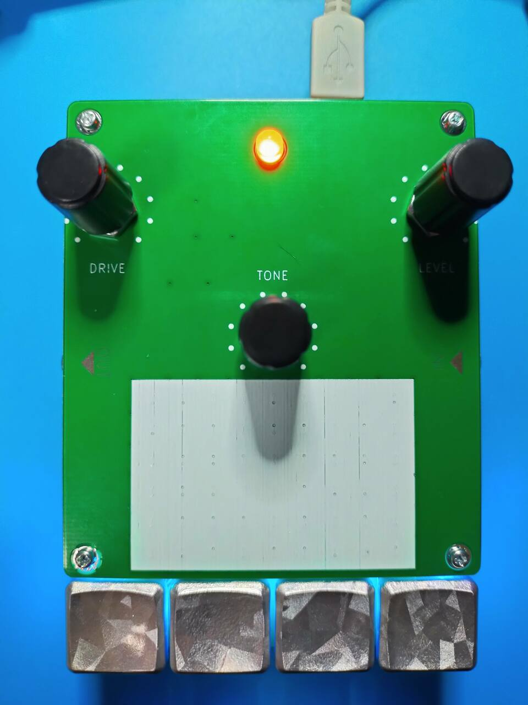

# ToneScraper

## 概要

[せきごんさん](https://github.com/sekigon-gonnoc)の[mtch6102評価基板](https://github.com/sekigon-gonnoc/mtch6102_breakout)を参考に、タッチパッドとロータリーエンコーダーを3機搭載した4キーマイクロパッド。

ロータリーエンコーダーは単色の光るエンコーダーかプッシュスイッチ付きのもののどちらか選んで実装できます。

## 部品リスト

| 品目                         | 数量 | 備考 |
| :--------------------------- | ---: | :--- |
| PCB                          |  1枚 |  |
| トッププレート               |  1枚 |  |
| ボトムプレート               |  1枚 |  |
| ProMicro                     |  1個 |  |
| コンスルー                   |  2本 |  |
| LED(SK6812mini)              |  4個 |  |
| MTCH6102                     |  1個 |  |
| レベル変換基板               |  1個 | https://nogikes.booth.pm/items/2008258 |
| 4pinピンヘッダー             |  1個 |  |
| ハーフピッチ5pinピンヘッダー |  1個 |  |
| アナログ5mm砲丸LED           |  1個 |  |
| 220Ω抵抗                    |  1個 |  |
| M2L8丸スペーサ               |  4本 |  |
| M2L7六角スペーサ(オスメス)   |  6本 |  |
| M2L4ネジ                     |  8本 |  |
| アングルタクトスイッチ       |  1個 |  |
| ゴム足                       |  4個 |  |
| KailhChocスイッチ            |  4個 |  |
| 1Uキーキャップ               |  4個 |  |
| USBケーブル                  |  1本 |  |
| TRRS JACK                    |  2個 | パームレスト for SilverbulletRequiemを光らせる場合 |
| TRRSまたはTRSケーブル        |  2本 | パームレスト for SilverbulletRequiemを光らせる場合必|
| 圧電サウンダ(PKLCS1212)      |  1個 | 圧電サウンダを実装する場合 |
| ダイオード                   |  1個 | 圧電サウンダを実装する場合 |
| 1KΩ抵抗                     |    1個 | 圧電サウンダを実装する場合 |
| 光るロータリーエンコーダー   | 3個 | [赤](https://akizukidenshi.com/catalog/g/gP-05762/) [青](https://akizukidenshi.com/catalog/g/gP-05768/) [黄緑](https://akizukidenshi.com/catalog/g/gP-05767/) |
| 100Ω抵抗                    |  3個 | 光るロータリーエンコーダーを実装する場合 |
| 通常ロータリーエンコーダー  |  3個 |  |

## 組み立て手順

### LEDの実装

LEDをはんだ付けします。  
欠けている足が右上の三角のシルクに対応します。



### アナログLED・抵抗の実装

アナログLEDの横の抵抗とLEDを実はんだ付けします。

LEDは数ミリ浮かせた状態で実装して、トッププレートを付けたときにはみ出るとかっこいいです。



圧電サウンダを使う場合、ダイオードと1kΩ抵抗、圧電サウンダを、
光るエンコーダーを使う場合、その他の抵抗のフットプリントに100Ω抵抗を実装します。

＊) 圧電サウンダの実装を忘れて写真を撮りました…！

### リセットスイッチ、TRRSジャックの実装

TRRSジャックと、タクトスイッチを実装します。



### レベル変換基板用のピンヘッダの実装

レベル変換基板用のピンヘッダをはんだ付けします。

標準ピッチ基板は表(スイッチ面)から見て一番右側は使っていないので左寄せにします。

ピンヘッダを傾けてはんだ付けしてしまうと変換基板がハマらないので、
変換基板を載せた状態でマスキングテープで固定して、裏からはんだ付けします。



続いてレベル変換基板をはんだ付けします。



### Chocスイッチとロータリーエンコーダーの実装

ロータリーエンコーダーとChocスイッチをはんだ付けします。



＊) chocの実装を忘れて写真を撮りました…！

### MTCH6102の実装

MTCH6102をトッププレートに実装します。  
ICに付いている丸い印が右上です。



### スペーサーの実装

スペーサーをはめます。  
上に丸、下に六角です。



### ネジ止め

トッププレート、ボトムプレートを挟んでネジ止めします。
ボトムプレートはリバーシブルで使えます。



### キャップ

ロータリーエンコーダー、Chocスイッチのキャップをはめて完成です！




## ファームウェア

ファームウェアは(ここ)[https://github.com/swanmatch/qmk_firmware/tree/master/keyboards/tone_scraper]に置いてあります。

以下の手順で書き込みます。

QMKの環境構築についてはお使いのOSによって異なりなりますので、
(公式ドキュメント)を読んでください。

```sh
git clone https://github.com/swanmatch/qmk_firmware.git
cd qmk_firmware
make git-submodule
make tone_scraper:default:avrdude
```
